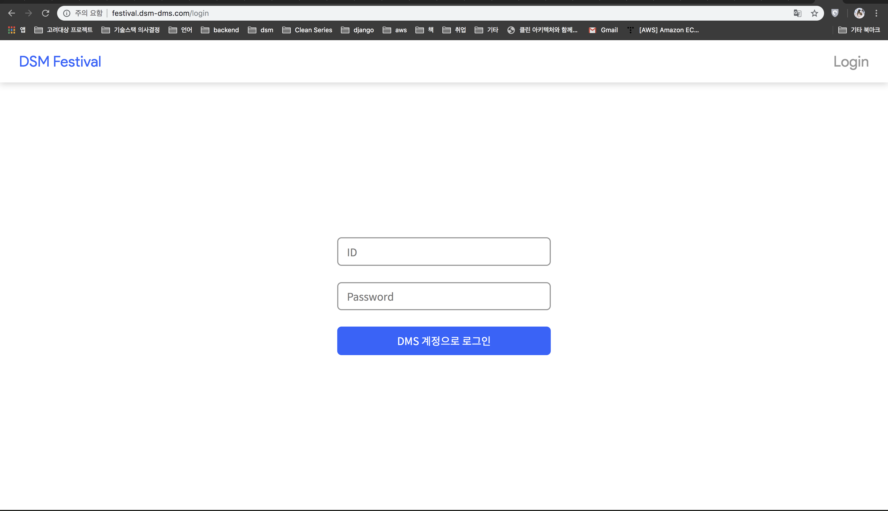
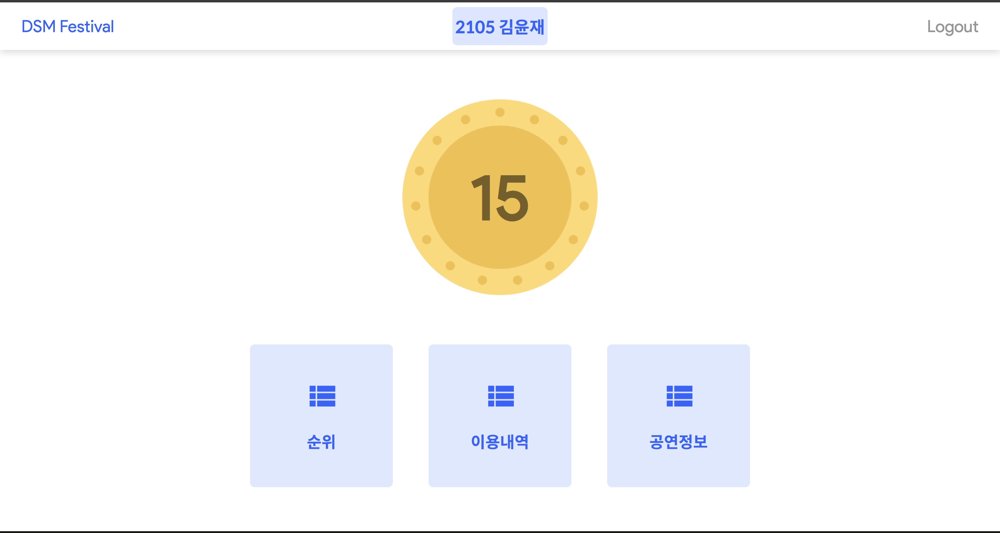
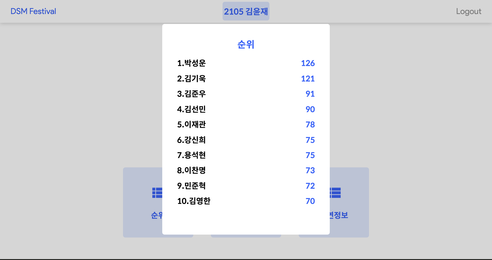
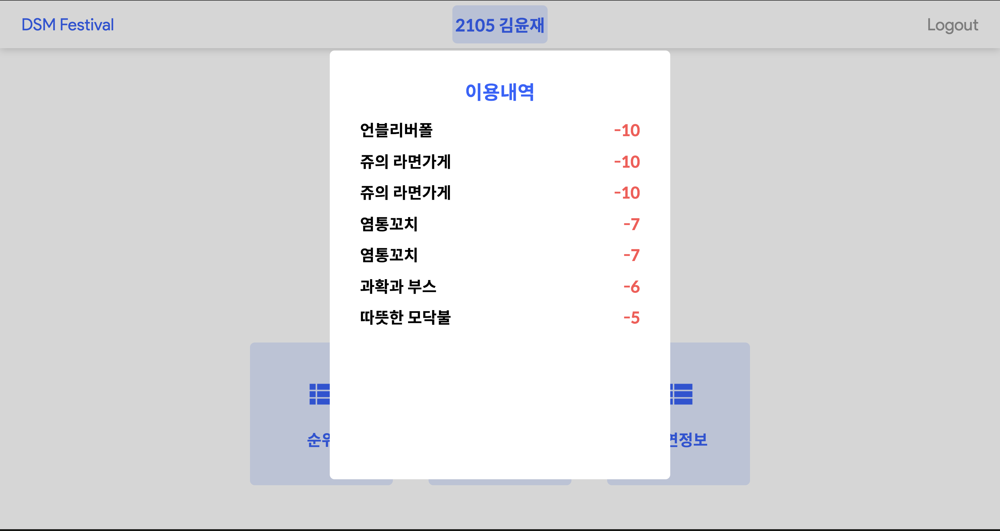
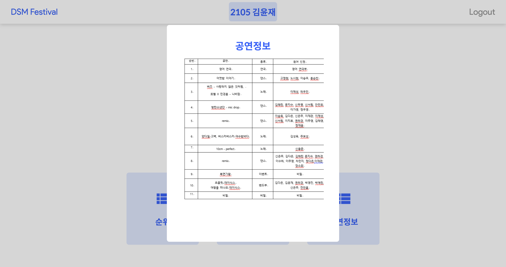

# Dsm-Festival
- Summary
  - 교내 축제에서 부스 참여나 상품을 구입할 때 가상 화폐를 사용하도록 기획하였습니다. 
  - RFID 카드를 전 교생에게 배부하고 각 카드마다 가지고 있는 화폐의 갯수를 지정하여 증감시키고 사용할 수 있는 시스템을 개발하였습니다.  
  
- Function
  - 로그인
  - 현재 가지고 있는 코인 갯수 조회
  - 전 교생 코인 갯수 랭킹 조회
  - 축제 공연 목록 조회
  - 부스 등록 
  - 부스-상품 등록(화폐 증감 수치 설정)
  - 결제
  

